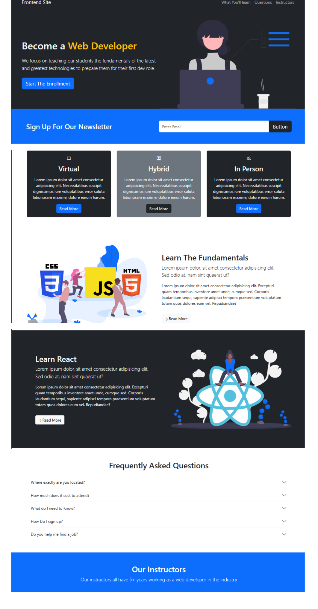
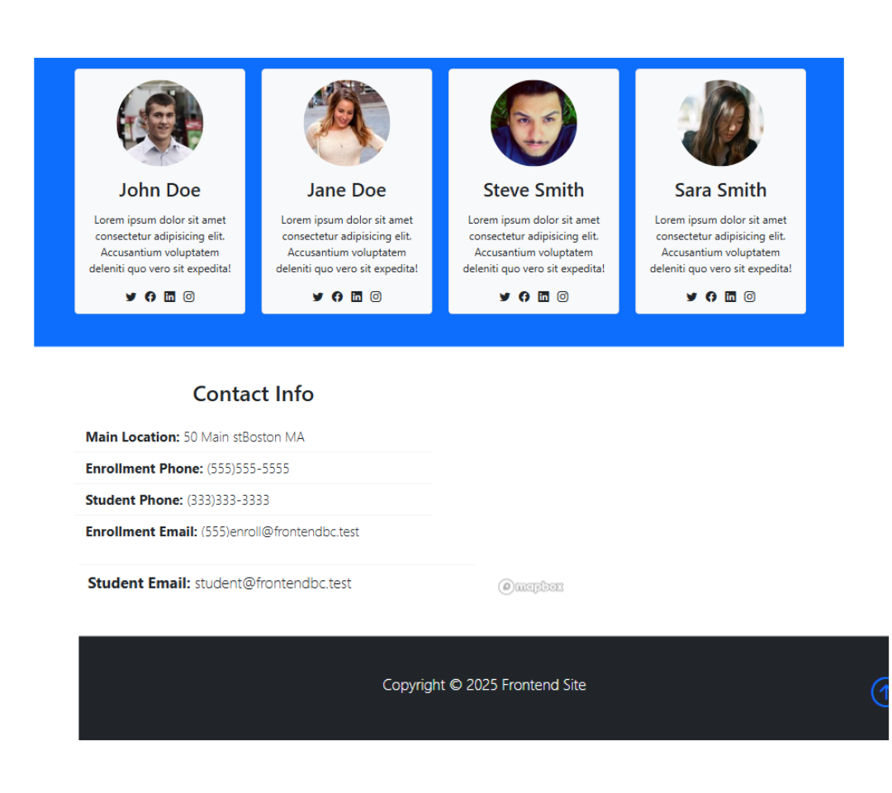

# 🚀 Responsive_Frontend_Clone


## 📌 Project Overview
This project is a **fully responsive and interactive** clone of a modern website UI, developed using **HTML, CSS, and Bootstrap 5**. The goal is to create a seamless user experience across different devices while ensuring that the layout adapts to various screen sizes.

## ✨ Features
✅ **Responsive UI** – Adapts to different screen sizes using Bootstrap's grid system  
✅ **Interactive Layout** – Smooth user experience with modern and clean design  
✅ **Bootstrap 5 Integration** – Leveraging Bootstrap 5 components for enhanced responsiveness  
✅ **Optimized Performance** – Lightweight and efficient code for fast loading  

## 🔧 Tech Stack
- **Frontend:** HTML, CSS, Bootstrap 5  

## 🚀 Upcoming Features
🔹 **Dark mode & customizable themes**  
🔹 **Enhanced navigation with smooth scrolling**  
🔹 **Improved UI components with animations**  
🔹 **Contact form with validation**  

## 📽️ Project Demo
### 🎥 Watch on YouTube  
[](https://youtu.be/QaCn5HV362E)
  

## 📂 Installation & Usage
1. Clone this repository:  
   ```bash
   git clone https://github.com/M-Meeran-Siddiqui/Responsive_Frontend_Clone.git
   ```

